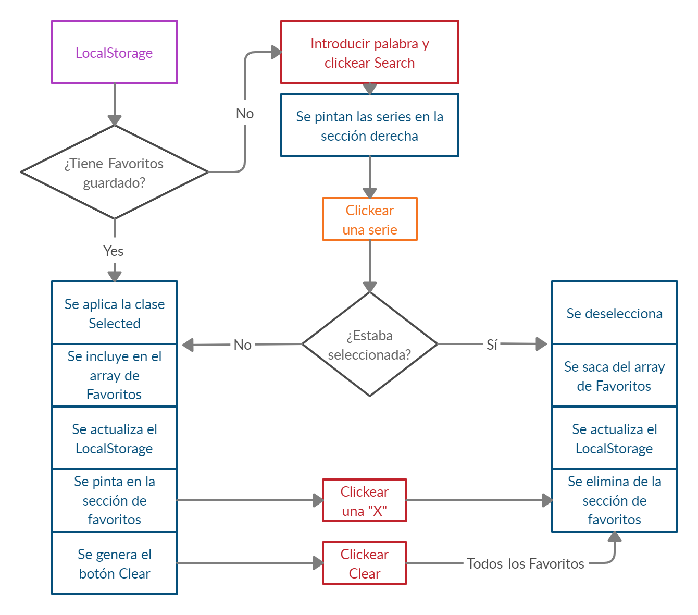

# Evaluación final del módulo 2 de Bárbara B. Sacristán

## Enunciado

El ejercicio consiste en desarrollar una aplicación web de búsqueda de series de TV, que nos permite des/marcar las series como favoritas y guardarlas en local storage.

### Pasos a seguir para el correcto desarrollo del ejercicio:

1. **Estructura básica**.
   - Consta de un campo de texto y un botón para buscar series por título.
   - listado de resultados de búsqueda donde aparece el cartel de la serie y el título.
1. **Búsqueda**.
   - Al hacer clic sobre el botón de Buscar, la aplicación debe conectarse al API abierto de TVMaze para búsqueda de series.
   - Para construir la URL de búsqueda hay que recoger el texto que ha introducido la usuaria en el campo de búsqueda.
   - Por cada show contenido en el resultado de la búsqueda hay que pintar una tarjeta donde mostramos una imagen de la serie y el título.
   - Algunas de las series que devuelve el API no tienen imagen. En ese caso hay que mostrar una imagen de relleno. Podemos crear una imagen de relleno con el servicio de placeholder.com donde en la propia URL indicamos el tamaño, colores, texto: https://via.placeholder.com/210x295/ffffff/666666/? text=TV.
   - Para pintar la información en la página se puede elegir entre hacerlo de forma básica con innerHTML o manipulando de forma avanzada el DOM.
1. **Favoritos**. Al hacer click sobre una serie, debe pasar lo siguiente:
   - El color de fondo y el de fuente se intercambian, indicando que es una serie favorita.
   - Hay que mostrar un listado en la parte izquierda de la pantalla, debajo del formulario de búsqueda, con las series favoritas.
   - Las series favoritas deben seguir apareciendo a la izquierda aunque la usuaria realice otra búsqueda.
1. **Almacenamiento local**. Hay que almacenar el listado de favoritos en el localStorage. De esta forma, al recargar la página el listado de favoritos se debe mostrarse.
1. **BONUS: Borrar favoritos** Como bonus, os proponemos la opción de borrar favoritos. Al hacer clic sobre el icono de una 'x' al lado de cada favorito, hay que borrar el favorito clicado de la lista y del localStorage.
   Para terminar de rematar nuestra app de series, nos gustaría poder añadir/quitar como favorito al hacer clic sobre una serie del lado de la derecha. Y que, si realizamos una nueva búsqueda y sale una serie que ya es favorita, aparezca ya resaltada en los resultados de búsqueda (con colores de fondo y texto intercambiados).
   Y ya sería fantástico si al final de la lista de favoritos hay un botón para borrarlos todos los favoritos a la vez.
1. **BONUS: Afinar la maquetación**. Una vez terminada la parte de interacción, podemos centrarnos en la parte de maquetación donde tenéis libertad para decidir los estilo. En cualquier caso os dejamos una propuesta gráfica.

### Pasos para arrancar el proyecto:

## Flujo de la web

En rojo están las posibles acciones iniciales del usuario:

## Cosas a mejorar

Estoy deseando recibir feedback, ya que ha sido un gran reto para mí enfrentarme a este ejercicio. Seguro que hay cosas que se pueden simplificar y que no lo he hecho por no tenerlo claro o por falta de tiempo. Aún así, me he divertido mucho con este buscador de series y espero que os guste!

FDO: BbeatrizSI :)
